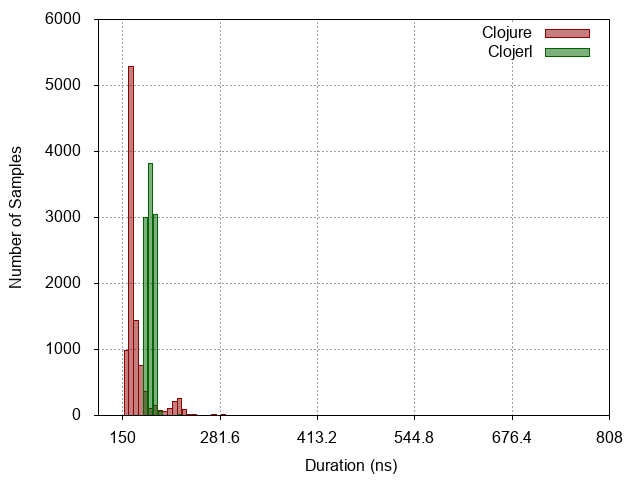
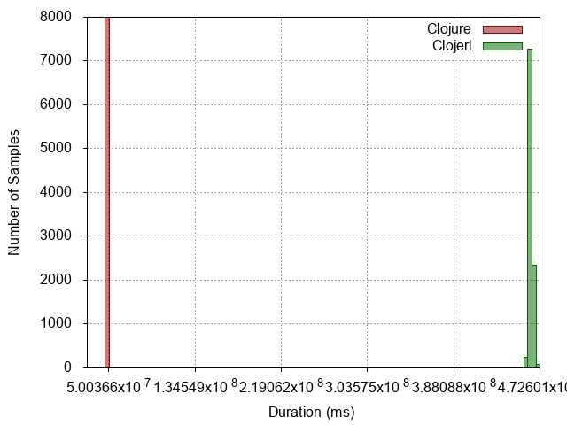
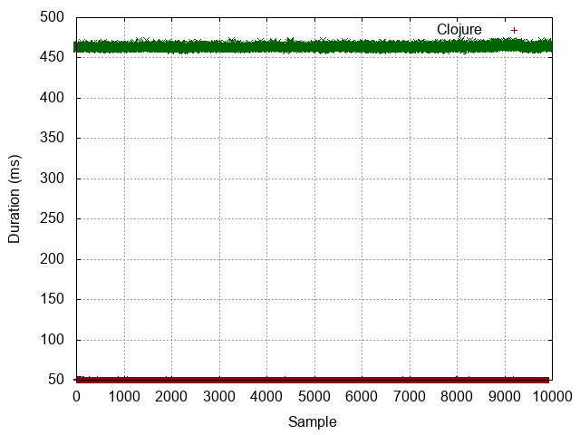
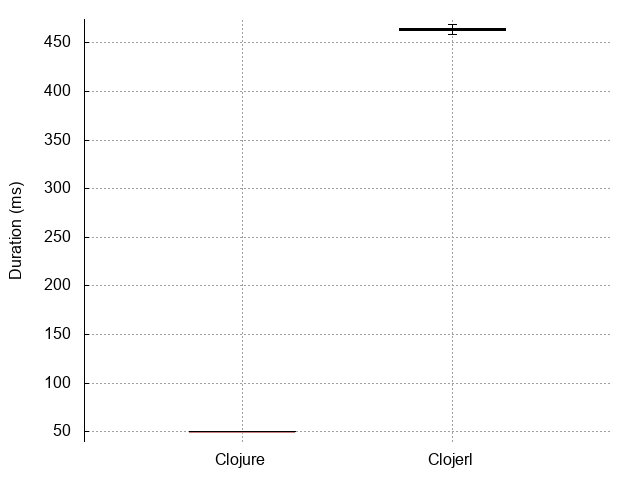

| :n |                  :experiment |                                                             :metrics-clj |                                                               :metrics-clje |                            :histogram |                            :points |                            :boxplot |
|----|------------------------------|--------------------------------------------------------------------------|-----------------------------------------------------------------------------|---------------------------------------|------------------------------------|-------------------------------------|
| -1 |                No expression |                  Mean = 69.8553 StdDev = 3.2732 Median = 69.0000 |                   Mean = 119.4155 StdDev = 5.8823 Median = 118.0000 |  |  |  |
|  0 |          Constant expression |                  Mean = 72.0046 StdDev = 6.4272 Median = 71.0000 |                   Mean = 122.0710 StdDev = 3.0589 Median = 122.0000 |   |   |   |
|  1 |         Simple function call |               Mean = 158.7356 StdDev = 19.8696 Median = 154.0000 |                  Mean = 128.6055 StdDev = 11.3604 Median = 127.0000 |   |   |   |
|  2 |                List creation |              Mean = 519.0971 StdDev = 418.2131 Median = 413.0000 |                  Mean = 205.2580 StdDev = 28.3186 Median = 208.0000 |   |   |   |
|  3 | Dynamic function application | Mean = 38483175.7089 StdDev = 879787.0082 Median = 38114539.0000 |  Mean = 102377973.2324 StdDev = 573089.7156 Median = 102067178.0000 |   |   |   |
|  4 |            Protocol dispatch |               Mean = 170.2203 StdDev = 24.2216 Median = 162.0000 |                  Mean = 188.3003 StdDev = 13.4356 Median = 187.0000 |   |   |   |
|  5 |  Read expression from string |         Mean = 11180.0874 StdDev = 1580.8290 Median = 11692.0000 |            Mean = 76139.0212 StdDev = 5331.7704 Median = 74369.0000 |   |   |   |
|  6 |           Last item in range |  Mean = 50103507.6486 StdDev = 87027.6413 Median = 50069377.0000 | Mean = 463689680.9411 StdDev = 1833394.6042 Median = 463507946.0000 |   |   |   |
|  7 |                   Tight loop |         Mean = 93660.2013 StdDev = 1278.2731 Median = 93509.0000 |       Mean = 1512195.4739 StdDev = 19960.5370 Median = 1508086.0000 |   |   |   |
