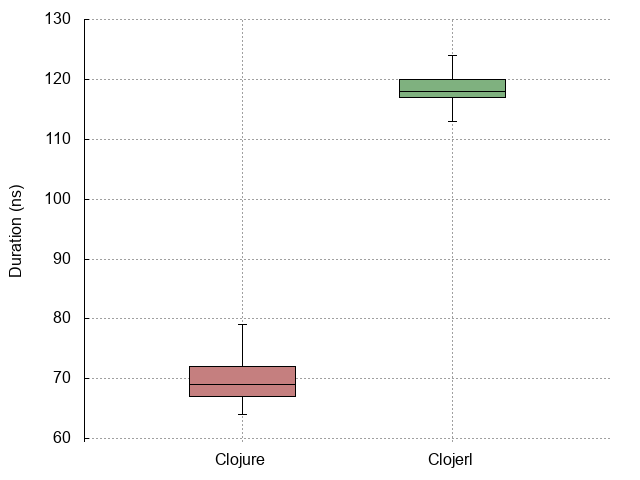
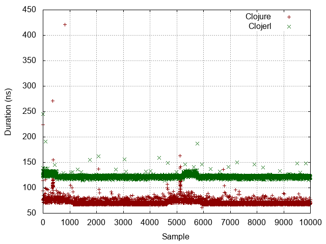
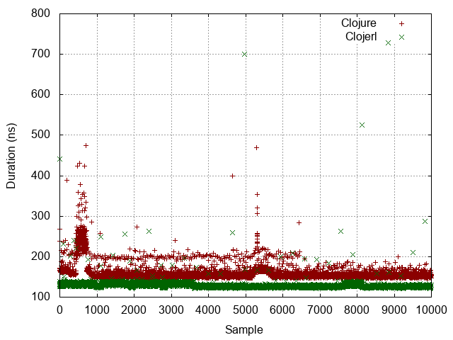
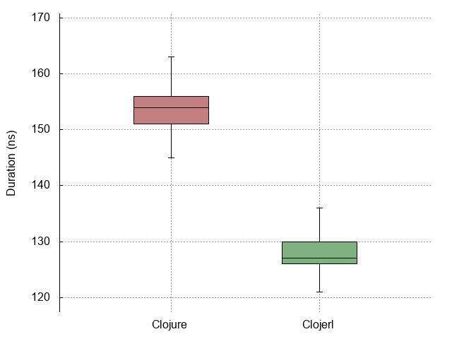
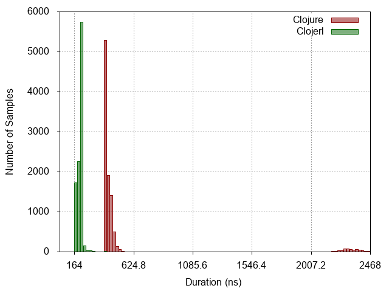
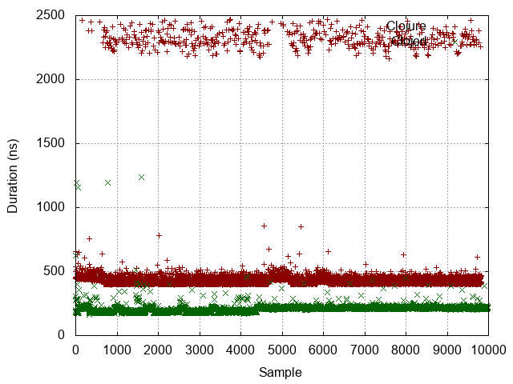
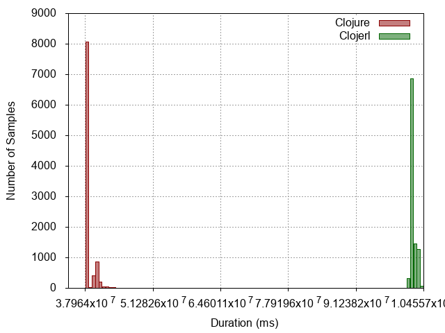
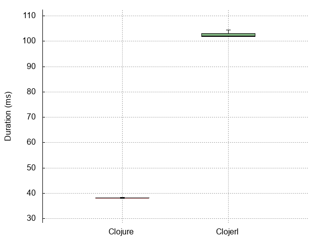
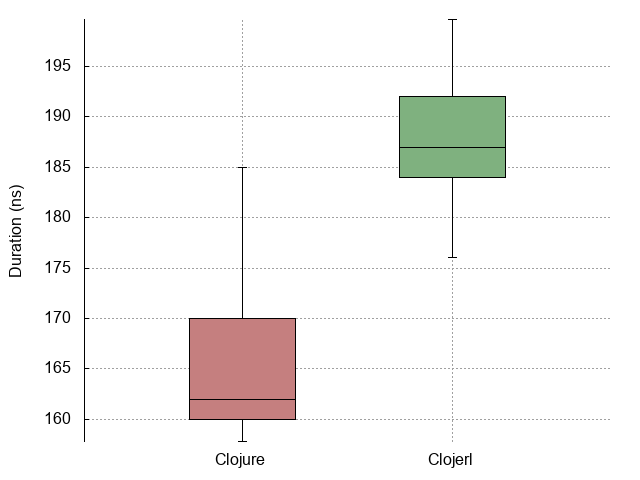
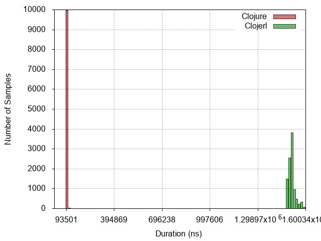

| :n |                  :experiment |                                                                       :metrics-clj |                                                                        :metrics-clje |                            :histogram |                            :points |                            :boxplot |
|----|------------------------------|------------------------------------------------------------------------------------|--------------------------------------------------------------------------------------|---------------------------------------|------------------------------------|-------------------------------------|
| -1 |                No expression |       Mean = 69.85534019785989 StdDev = 3.273237331304862 Median = 74  |       Mean = 119.41549084359052 StdDev = 5.882287745267106 Median = 117  |  |  |  |
|  0 |          Constant expression |      Mean = 72.00460092018403 StdDev = 6.4272420775872785 Median = 75  |      Mean = 122.07103551775887 StdDev = 3.0589270987939865 Median = 123  |   |   |   |
|  1 |         Simple function call |     Mean = 158.73562068620586 StdDev = 19.86955621866284 Median = 157  |      Mean = 128.60548438751002 StdDev = 11.360437032492085 Median = 128  |   |   |   |
|  2 |                List creation |      Mean = 519.0970597212331 StdDev = 418.2130816302439 Median = 453  |      Mean = 205.25796433580444 StdDev = 28.318551637466648 Median = 206  |   |   |   |
|  3 | Dynamic function application |  Mean = 38483175.70894829 StdDev = 879787.008177028 Median = 38042424  | Mean = 102377973.23238306 StdDev = 573089.7156460296 Median = 101969072  |   |   |   |
|  4 |            Protocol dispatch |    Mean = 170.22033219931959 StdDev = 24.221554307382853 Median = 177  |        Mean = 188.30029037749074 StdDev = 13.4356061673002 Median = 186  |   |   |   |
|  5 |  Read expression from string |   Mean = 11180.087434449375 StdDev = 1580.8290084932714 Median = 9269  |      Mean = 76139.02120424085 StdDev = 5331.770409093918 Median = 74173  |   |   |   |
|  6 |           Last item in range | Mean = 50103507.64857517 StdDev = 87027.64125387972 Median = 50099627  | Mean = 463689680.94114095 StdDev = 1833394.604189345 Median = 463347006  |   |   |   |
|  7 |                   Tight loop |    Mean = 93660.2012805122 StdDev = 1278.2731208826506 Median = 93508  |    Mean = 1512195.473917422 StdDev = 19960.53702741821 Median = 1507913  |   |   |   |
