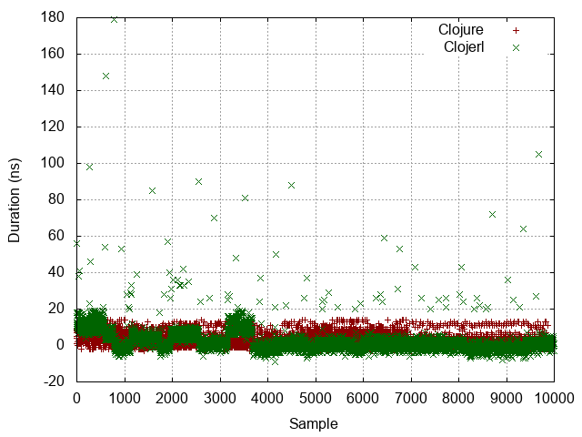
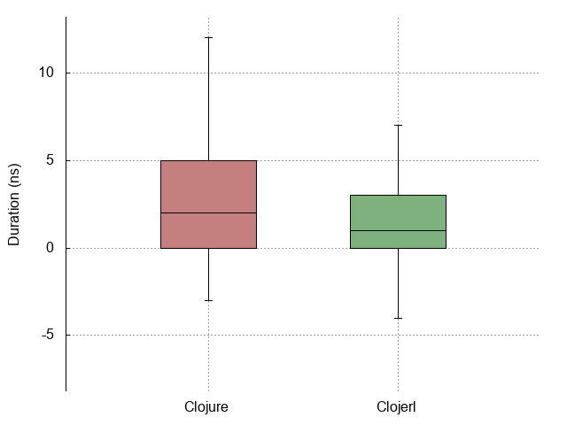
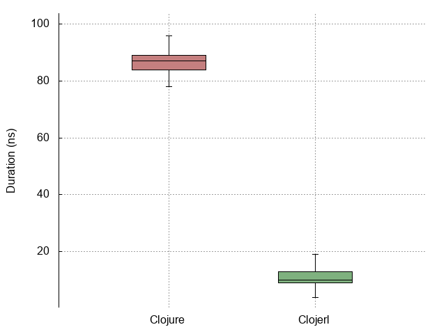
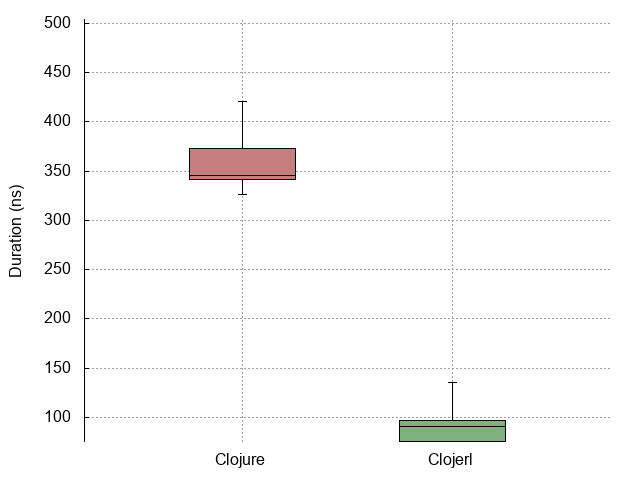
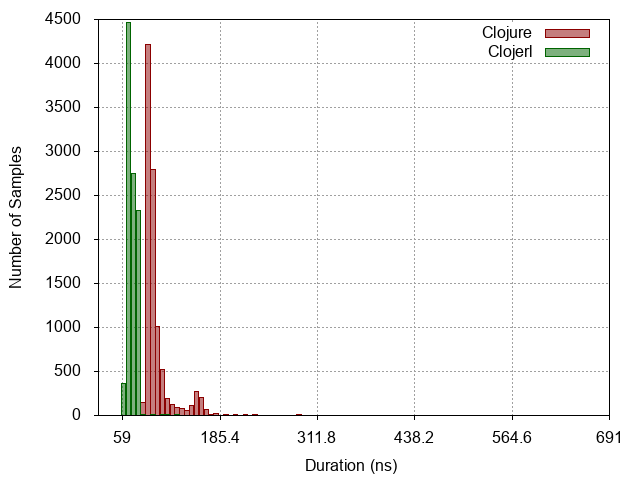
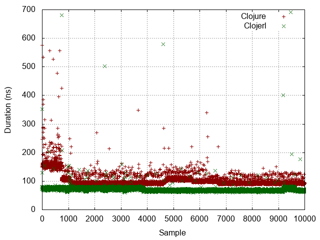

| :n |                  :experiment |                                                                       :metrics-clj |                                                                        :metrics-clje |                                        :histogram |                                        :points |                                        :boxplot |
|----|------------------------------|------------------------------------------------------------------------------------|--------------------------------------------------------------------------------------|---------------------------------------------------|------------------------------------------------|-------------------------------------------------|
| -1 |                No expression |      Mean = 3.8553401978598827 StdDev = 3.2732373313048635 Median = 8  |          Mean = 6.415490843590513 StdDev = 5.882287745267106 Median = 4  |  |  |  |
|  0 |          Constant expression |      Mean = 6.0046009201840365 StdDev = 6.4272420775872785 Median = 9  |          Mean = 9.07103551775888 StdDev = 3.058927098793984 Median = 10  |   |   |   |
|  1 |         Simple function call |       Mean = 92.73562068620586 StdDev = 19.86955621866284 Median = 91  |       Mean = 15.605484387510009 StdDev = 11.360437032492088 Median = 15  |   |   |   |
|  2 |                List creation |      Mean = 453.0970597212331 StdDev = 418.2130816302439 Median = 387  |        Mean = 92.25796433580444 StdDev = 28.318551637466648 Median = 93  |   |   |   |
|  3 | Dynamic function application |  Mean = 38483109.70894829 StdDev = 879787.008177028 Median = 38042358  | Mean = 102377860.23238306 StdDev = 573089.7156460296 Median = 101968959  |   |   |   |
|  4 |            Protocol dispatch |    Mean = 104.22033219931959 StdDev = 24.221554307382853 Median = 111  |          Mean = 75.30029037749074 StdDev = 13.4356061673002 Median = 73  |   |   |   |
|  5 |  Read expression from string |   Mean = 11114.087434449375 StdDev = 1580.8290084932714 Median = 9203  |      Mean = 76026.02120424085 StdDev = 5331.770409093918 Median = 74060  |   |   |   |
|  6 |           Last item in range | Mean = 50103441.64857517 StdDev = 87027.64125387972 Median = 50099561  | Mean = 463689567.94114095 StdDev = 1833394.604189345 Median = 463346893  |   |   |   |
|  7 |                   Tight loop |    Mean = 93594.2012805122 StdDev = 1278.2731208826506 Median = 93442  |    Mean = 1512082.473917422 StdDev = 19960.53702741821 Median = 1507800  |   |   |   |
