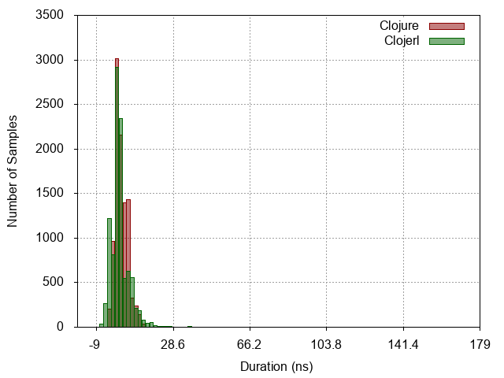
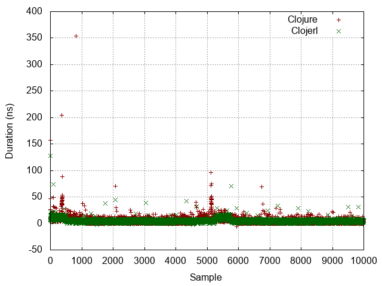
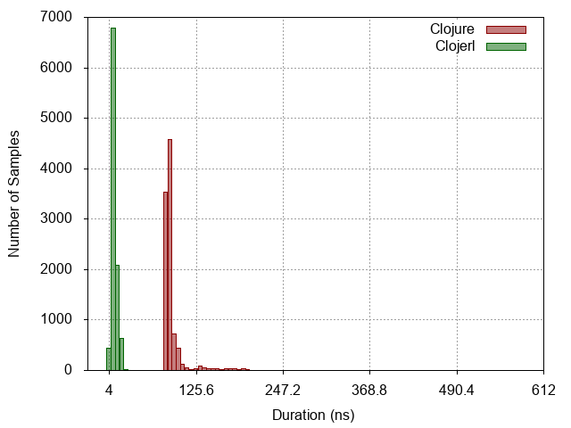
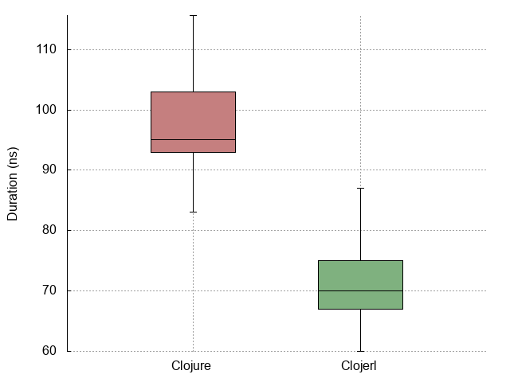
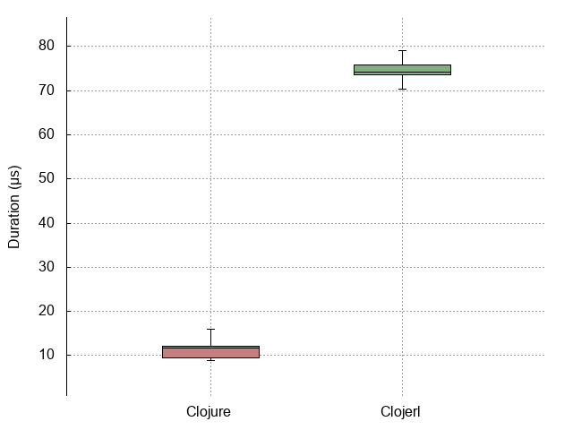

| :n |                  :experiment |                                        :histogram |                                        :points |                                        :boxplot |
|----|------------------------------|---------------------------------------------------|------------------------------------------------|-------------------------------------------------|
| -1 |                No expression |  |  |  |
|  0 |          Constant expression |   |   |   |
|  1 |         Simple function call |   |   |   |
|  2 |                List creation |   |   |   |
|  3 | Dynamic function application |   |   |   |
|  4 |            Protocol dispatch |   |   |   |
|  5 |  Read expression from string |   |   |   |
|  6 |           Last item in range |   |   |   |
|  7 |                   Tight loop |   |   |   |
