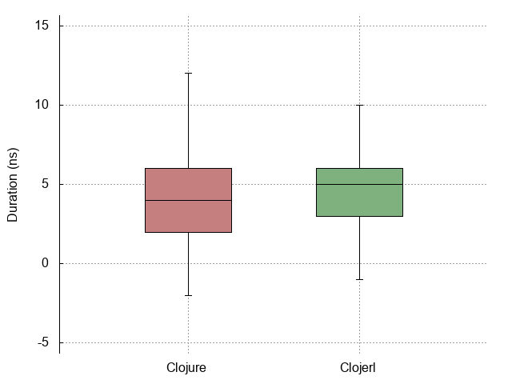
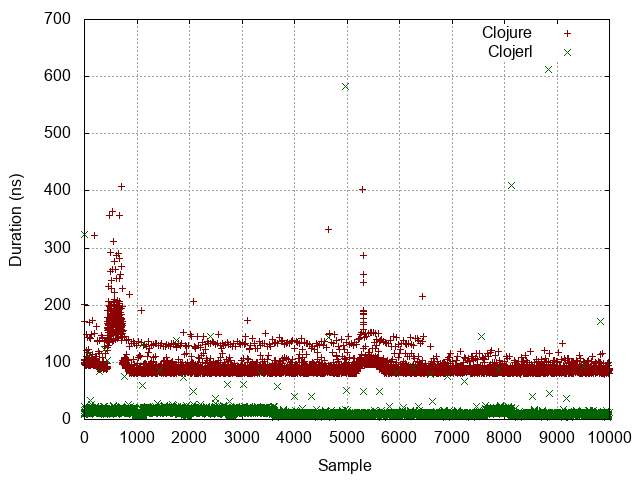
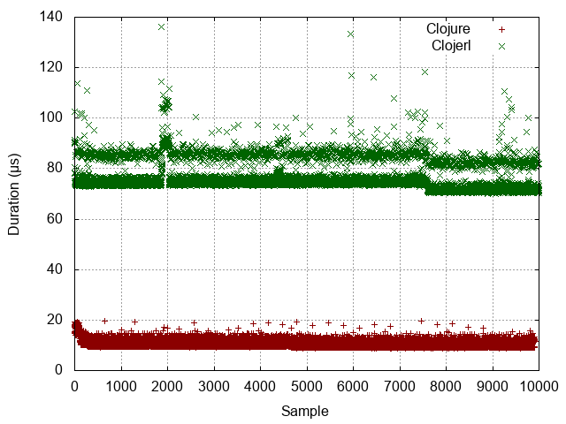
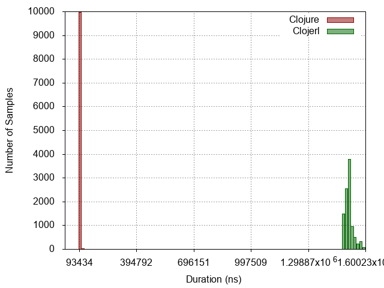

| :n |                  :experiment |                                                             :metrics-clj |                                                               :metrics-clje |                                        :histogram |                                        :points |                                        :boxplot |
|----|------------------------------|--------------------------------------------------------------------------|-----------------------------------------------------------------------------|---------------------------------------------------|------------------------------------------------|-------------------------------------------------|
| -1 |                No expression |                    Mean = 3.8553 StdDev = 3.2732 Median = 3.0000 |                       Mean = 6.4155 StdDev = 5.8823 Median = 5.0000 |  |  |  |
|  0 |          Constant expression |                    Mean = 6.0046 StdDev = 6.4272 Median = 5.0000 |                       Mean = 9.0710 StdDev = 3.0589 Median = 9.0000 |   |   |   |
|  1 |         Simple function call |                 Mean = 92.7356 StdDev = 19.8696 Median = 88.0000 |                    Mean = 15.6055 StdDev = 11.3604 Median = 14.0000 |   |   |   |
|  2 |                List creation |              Mean = 453.0971 StdDev = 418.2131 Median = 347.0000 |                    Mean = 92.2580 StdDev = 28.3186 Median = 95.0000 |   |   |   |
|  3 | Dynamic function application | Mean = 38483109.7089 StdDev = 879787.0082 Median = 38114473.0000 |  Mean = 102377860.2324 StdDev = 573089.7156 Median = 102067065.0000 |   |   |   |
|  4 |            Protocol dispatch |                Mean = 104.2203 StdDev = 24.2216 Median = 96.0000 |                    Mean = 75.3003 StdDev = 13.4356 Median = 74.0000 |   |   |   |
|  5 |  Read expression from string |         Mean = 11114.0874 StdDev = 1580.8290 Median = 11626.0000 |            Mean = 76026.0212 StdDev = 5331.7704 Median = 74256.0000 |   |   |   |
|  6 |           Last item in range |  Mean = 50103441.6486 StdDev = 87027.6413 Median = 50069311.0000 | Mean = 463689567.9411 StdDev = 1833394.6042 Median = 463507833.0000 |   |   |   |
|  7 |                   Tight loop |         Mean = 93594.2013 StdDev = 1278.2731 Median = 93443.0000 |       Mean = 1512082.4739 StdDev = 19960.5370 Median = 1507973.0000 |   |   |   |
