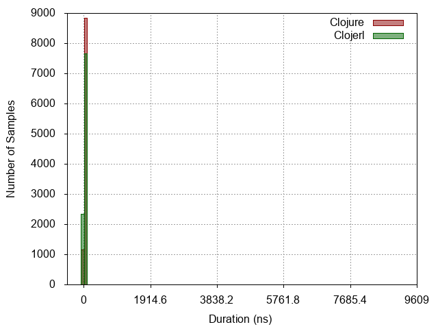
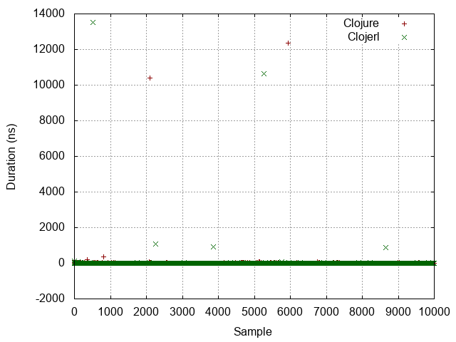
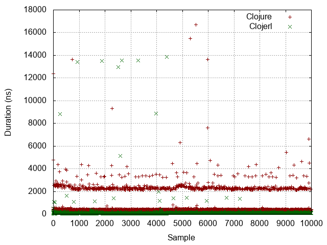
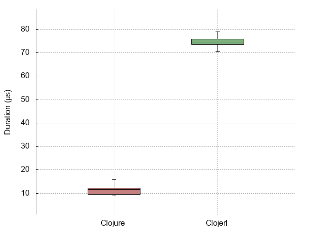
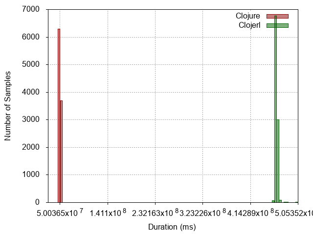
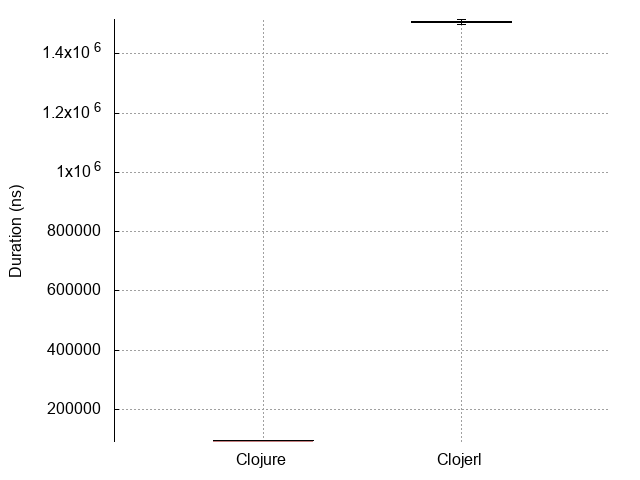

| :n |                  :experiment |                                                              :metrics-clj |                                                               :metrics-clje |                               :histogram |                               :points |                               :boxplot |
|----|------------------------------|---------------------------------------------------------------------------|-----------------------------------------------------------------------------|------------------------------------------|---------------------------------------|----------------------------------------|
| -1 |                No expression |                     Mean = 4.0063 StdDev = 3.7815 Median = 3.0000 |                      Mean = 7.7284 StdDev = 97.4033 Median = 5.0000 |  |  |  |
|  0 |          Constant expression |                   Mean = 8.2791 StdDev = 161.5242 Median = 5.0000 |                    Mean = 11.7721 StdDev = 172.8567 Median = 9.0000 |   |   |   |
|  1 |         Simple function call |                 Mean = 95.9017 StdDev = 193.0736 Median = 88.0000 |                   Mean = 21.4028 StdDev = 255.3728 Median = 14.0000 |   |   |   |
|  2 |                List creation |               Mean = 504.3183 StdDev = 632.7734 Median = 347.0000 |                  Mean = 103.7628 StdDev = 357.3604 Median = 95.0000 |   |   |   |
|  3 | Dynamic function application | Mean = 38723677.1994 StdDev = 1678711.4003 Median = 38117257.0000 |  Mean = 102397890.6151 StdDev = 721087.7892 Median = 102068197.0000 |   |   |   |
|  4 |            Protocol dispatch |                Mean = 107.3395 StdDev = 172.7034 Median = 96.0000 |                   Mean = 81.8360 StdDev = 243.7750 Median = 74.0000 |   |   |   |
|  5 |  Read expression from string |          Mean = 11288.7374 StdDev = 2817.3338 Median = 11633.0000 |           Mean = 76251.1225 StdDev = 22109.0262 Median = 74257.0000 |   |   |   |
|  6 |           Last item in range |  Mean = 50142100.4251 StdDev = 577466.7645 Median = 50069560.0000 | Mean = 463856160.0603 StdDev = 2928769.3192 Median = 463518397.0000 |   |   |   |
|  7 |                   Tight loop |         Mean = 93946.6347 StdDev = 28319.7537 Median = 93443.0000 |       Mean = 1513173.1345 StdDev = 30957.5496 Median = 1507983.0000 |   |   |   |
