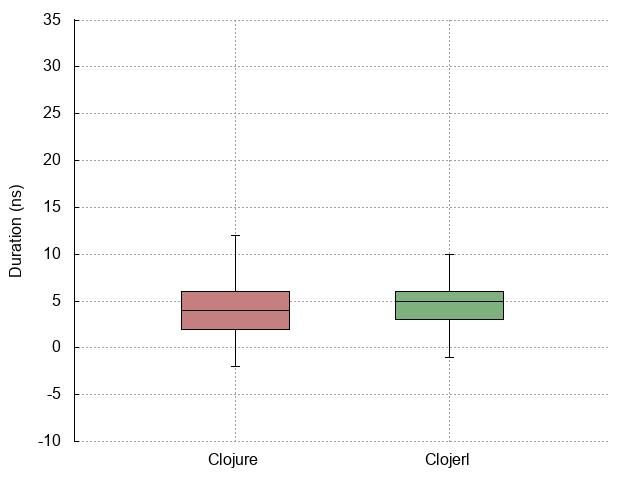
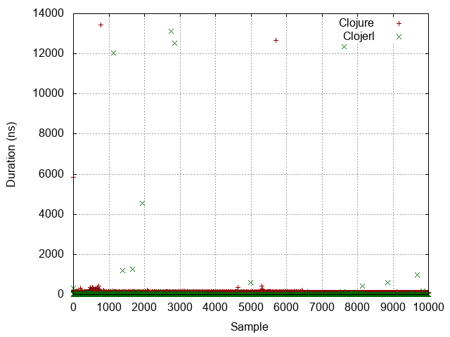
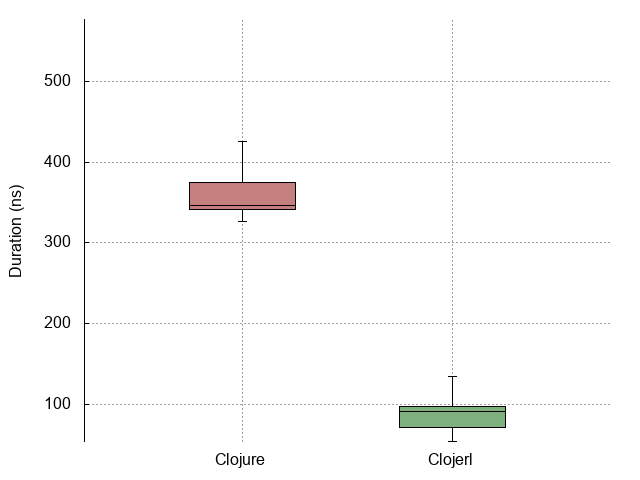

| :n |                  :experiment |                                                                    :metrics-clj |                                                                     :metrics-clje |                               :histogram |                               :points |                               :boxplot |
|----|------------------------------|---------------------------------------------------------------------------------|-----------------------------------------------------------------------------------|------------------------------------------|---------------------------------------|----------------------------------------|
| -1 |                No expression |               Mean = 4.0063 StdDev = 3.7814627209587246 Median = 8  |                  Mean = 7.7284 StdDev = 97.40334611006936 Median = 4  |  |  |  |
|  0 |          Constant expression |               Mean = 8.2791 StdDev = 161.52420686445254 Median = 9  |               Mean = 11.7721 StdDev = 172.85666363087307 Median = 10  |   |   |   |
|  1 |         Simple function call |             Mean = 95.9017 StdDev = 193.07361610822414 Median = 91  |               Mean = 21.4028 StdDev = 255.37280542799465 Median = 14  |   |   |   |
|  2 |                List creation |            Mean = 504.3183 StdDev = 632.7734461757449 Median = 380  |               Mean = 103.7628 StdDev = 357.3603695657385 Median = 95  |   |   |   |
|  3 | Dynamic function application | Mean = 38723677.1994 StdDev = 1678711.4002915586 Median = 38085454  |  Mean = 102397890.6151 StdDev = 721087.7891824121 Median = 101968959  |   |   |   |
|  4 |            Protocol dispatch |            Mean = 107.3395 StdDev = 172.7033648767421 Median = 105  |                Mean = 81.836 StdDev = 243.77500672546475 Median = 72  |   |   |   |
|  5 |  Read expression from string |         Mean = 11288.7374 StdDev = 2817.333817502148 Median = 9094  |          Mean = 76251.1225 StdDev = 22109.02619905024 Median = 73684  |   |   |   |
|  6 |           Last item in range |  Mean = 50142100.4251 StdDev = 577466.7645454715 Median = 50042301  | Mean = 463856160.0603 StdDev = 2928769.3192424644 Median = 463699673  |   |   |   |
|  7 |                   Tight loop |       Mean = 93946.6347 StdDev = 28319.753658189184 Median = 93443  |     Mean = 1513173.1345 StdDev = 30957.549578124166 Median = 1508207  |   |   |   |
