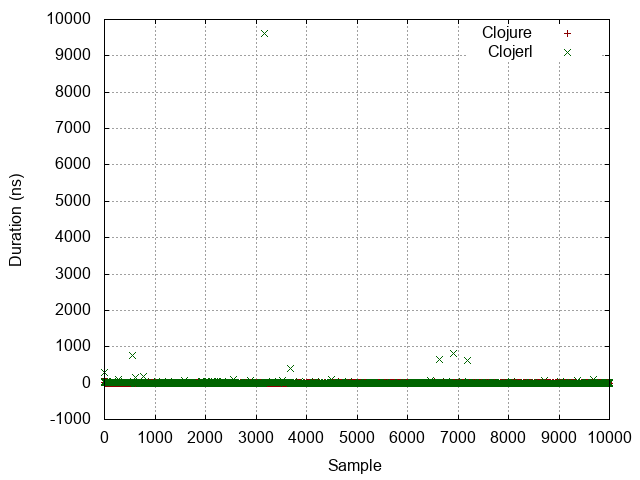
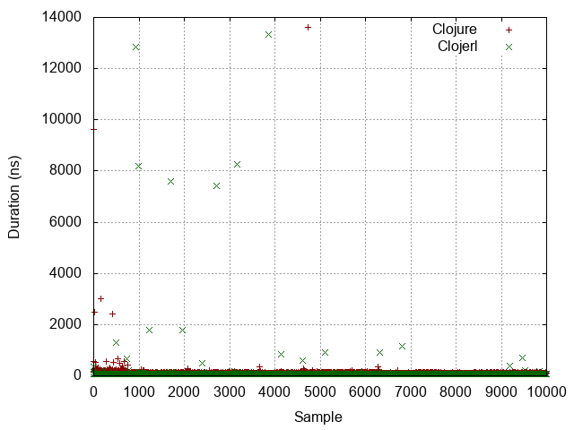
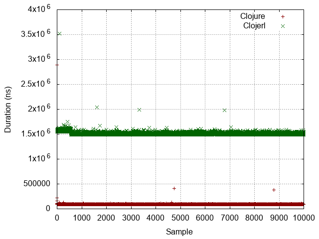

| :n |                  :experiment |                                                              :metrics-clj |                                                               :metrics-clje |                               :histogram |                               :points |                               :boxplot |
|----|------------------------------|---------------------------------------------------------------------------|-----------------------------------------------------------------------------|------------------------------------------|---------------------------------------|----------------------------------------|
| -1 |                No expression |                     Mean = 3.0063 StdDev = 3.7815 Median = 2.0000 |                      Mean = 3.7284 StdDev = 97.4033 Median = 1.0000 |  |  |  |
|  0 |          Constant expression |                   Mean = 7.2791 StdDev = 161.5242 Median = 4.0000 |                     Mean = 7.7721 StdDev = 172.8567 Median = 5.0000 |   |   |   |
|  1 |         Simple function call |                 Mean = 94.9017 StdDev = 193.0736 Median = 87.0000 |                   Mean = 17.4028 StdDev = 255.3728 Median = 10.0000 |   |   |   |
|  2 |                List creation |               Mean = 503.3183 StdDev = 632.7734 Median = 346.0000 |                   Mean = 99.7628 StdDev = 357.3604 Median = 91.0000 |   |   |   |
|  3 | Dynamic function application | Mean = 38723676.1994 StdDev = 1678711.4003 Median = 38117256.0000 |  Mean = 102397886.6151 StdDev = 721087.7892 Median = 102068193.0000 |   |   |   |
|  4 |            Protocol dispatch |                Mean = 106.3395 StdDev = 172.7034 Median = 95.0000 |                   Mean = 77.8360 StdDev = 243.7750 Median = 70.0000 |   |   |   |
|  5 |  Read expression from string |          Mean = 11287.7374 StdDev = 2817.3338 Median = 11632.0000 |           Mean = 76247.1225 StdDev = 22109.0262 Median = 74253.0000 |   |   |   |
|  6 |           Last item in range |  Mean = 50142099.4251 StdDev = 577466.7645 Median = 50069559.0000 | Mean = 463856156.0603 StdDev = 2928769.3192 Median = 463518393.0000 |   |   |   |
|  7 |                   Tight loop |         Mean = 93945.6347 StdDev = 28319.7537 Median = 93442.0000 |       Mean = 1513169.1345 StdDev = 30957.5496 Median = 1507979.0000 |   |   |   |
