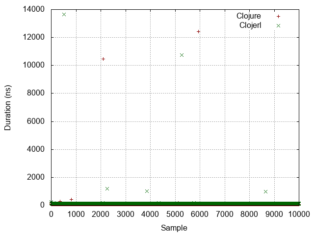
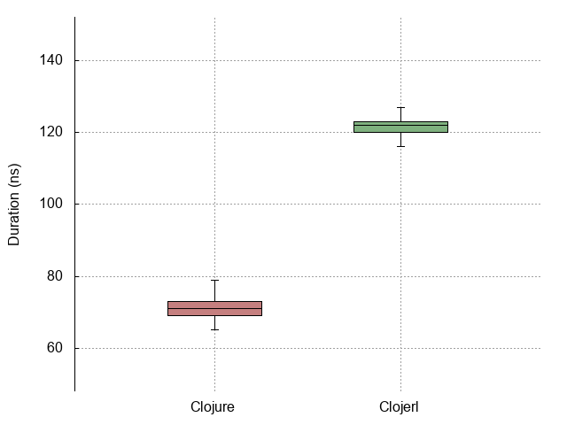
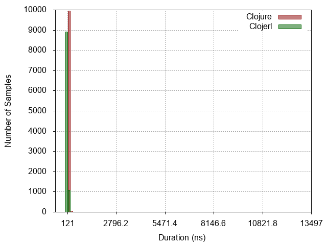
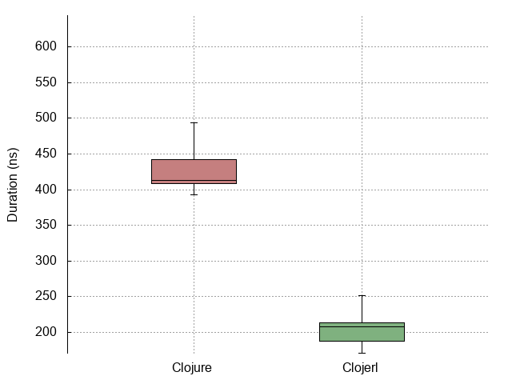
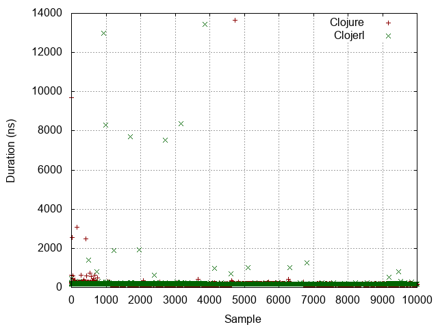
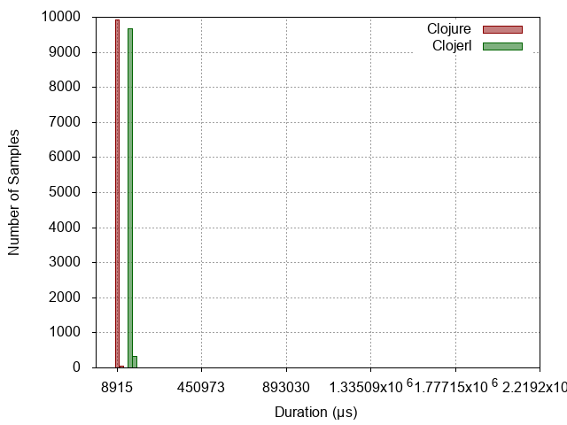
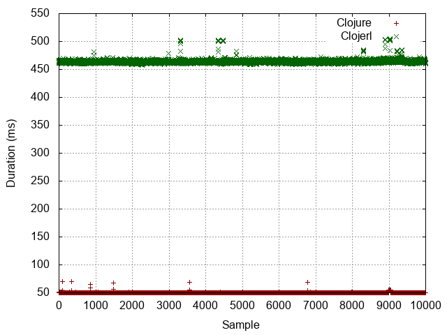
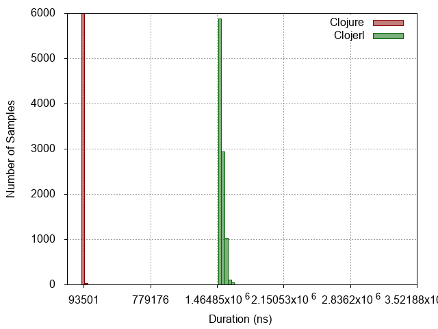

| :n |                  :experiment |                                                              :metrics-clj |                                                               :metrics-clje |                   :histogram |                   :points |                   :boxplot |
|----|------------------------------|---------------------------------------------------------------------------|-----------------------------------------------------------------------------|------------------------------|---------------------------|----------------------------|
| -1 |                No expression |                   Mean = 70.0063 StdDev = 3.7815 Median = 74.0000 |                  Mean = 120.7284 StdDev = 97.4033 Median = 117.0000 |  |  |  |
|  0 |          Constant expression |                 Mean = 74.2791 StdDev = 161.5242 Median = 75.0000 |                 Mean = 124.7721 StdDev = 172.8567 Median = 123.0000 |   |   |   |
|  1 |         Simple function call |               Mean = 161.9017 StdDev = 193.0736 Median = 157.0000 |                 Mean = 134.4028 StdDev = 255.3728 Median = 127.0000 |   |   |   |
|  2 |                List creation |               Mean = 570.3183 StdDev = 632.7734 Median = 446.0000 |                 Mean = 216.7628 StdDev = 357.3604 Median = 208.0000 |   |   |   |
|  3 | Dynamic function application | Mean = 38723743.1994 StdDev = 1678711.4003 Median = 38085520.0000 |  Mean = 102398003.6151 StdDev = 721087.7892 Median = 101969072.0000 |   |   |   |
|  4 |            Protocol dispatch |               Mean = 173.3395 StdDev = 172.7034 Median = 171.0000 |                 Mean = 194.8360 StdDev = 243.7750 Median = 185.0000 |   |   |   |
|  5 |  Read expression from string |           Mean = 11354.7374 StdDev = 2817.3338 Median = 9160.0000 |           Mean = 76364.1225 StdDev = 22109.0262 Median = 73797.0000 |   |   |   |
|  6 |           Last item in range |  Mean = 50142166.4251 StdDev = 577466.7645 Median = 50042367.0000 | Mean = 463856273.0603 StdDev = 2928769.3192 Median = 463699786.0000 |   |   |   |
|  7 |                   Tight loop |         Mean = 94012.6347 StdDev = 28319.7537 Median = 93509.0000 |       Mean = 1513286.1345 StdDev = 30957.5496 Median = 1508320.0000 |   |   |   |
