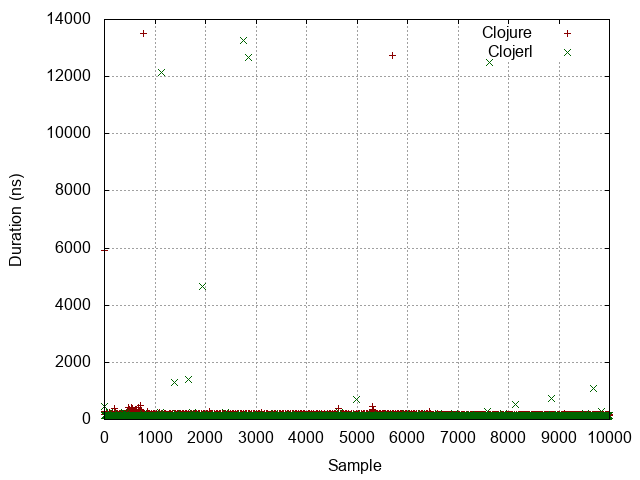
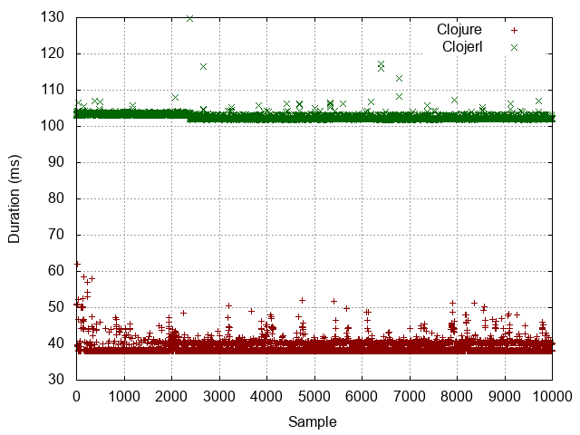
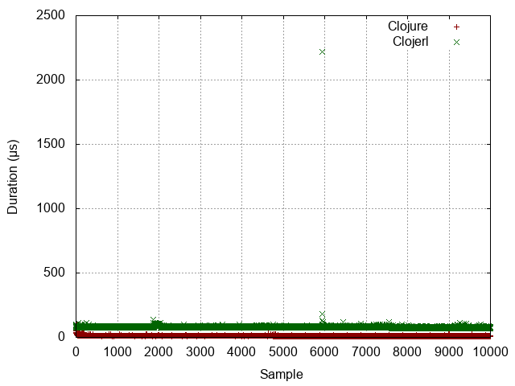
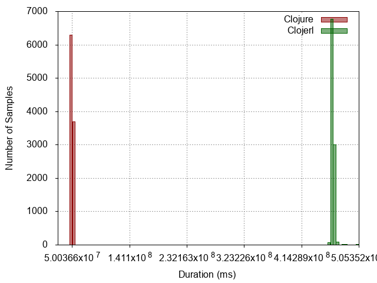

| :n |                  :experiment |                                                                    :metrics-clj |                                                                     :metrics-clje |                   :histogram |                   :points |                   :boxplot |
|----|------------------------------|---------------------------------------------------------------------------------|-----------------------------------------------------------------------------------|------------------------------|---------------------------|----------------------------|
| -1 |                No expression |             Mean = 70.0063 StdDev = 3.7814627209587246 Median = 74  |              Mean = 120.7284 StdDev = 97.40334611006936 Median = 117  |  |  |  |
|  0 |          Constant expression |             Mean = 74.2791 StdDev = 161.52420686445254 Median = 75  |             Mean = 124.7721 StdDev = 172.85666363087307 Median = 123  |   |   |   |
|  1 |         Simple function call |           Mean = 161.9017 StdDev = 193.07361610822414 Median = 157  |             Mean = 134.4028 StdDev = 255.37280542799465 Median = 127  |   |   |   |
|  2 |                List creation |            Mean = 570.3183 StdDev = 632.7734461757449 Median = 446  |              Mean = 216.7628 StdDev = 357.3603695657385 Median = 208  |   |   |   |
|  3 | Dynamic function application | Mean = 38723743.1994 StdDev = 1678711.4002915586 Median = 38085520  |  Mean = 102398003.6151 StdDev = 721087.7891824121 Median = 101969072  |   |   |   |
|  4 |            Protocol dispatch |            Mean = 173.3395 StdDev = 172.7033648767421 Median = 171  |              Mean = 194.836 StdDev = 243.77500672546475 Median = 185  |   |   |   |
|  5 |  Read expression from string |         Mean = 11354.7374 StdDev = 2817.333817502148 Median = 9160  |          Mean = 76364.1225 StdDev = 22109.02619905024 Median = 73797  |   |   |   |
|  6 |           Last item in range |  Mean = 50142166.4251 StdDev = 577466.7645454715 Median = 50042367  | Mean = 463856273.0603 StdDev = 2928769.3192424644 Median = 463699786  |   |   |   |
|  7 |                   Tight loop |       Mean = 94012.6347 StdDev = 28319.753658189184 Median = 93509  |     Mean = 1513286.1345 StdDev = 30957.549578124166 Median = 1508320  |   |   |   |
